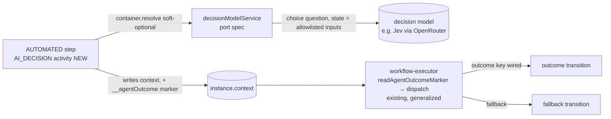

# Workflows: AI Decision Step

> Status: **Draft — design-only spec PR; implementation waits for core-team acceptance** of the OSS placement (see [Decisions in play](#-decisions-in-play)).
> **Depends on:** [`2026-10-06-ai-decision-model-port.md`](2026-10-06-ai-decision-model-port.md) (decision model port, `decisionModelService`).

## 📝 TLDR

**Key points:**
- Workflow authors who need a branch based on *meaning* (an email body, a free-text note, a return reason) have two options today: a human `USER_TASK`, or the enterprise-only `INVOKE_AGENT`, which needs `agent_orchestrator`, a registered agent and a proposal/disposition pipeline.
- **Proposed (future behavior):** a lightweight OSS activity `AI_DECISION` on an `AUTOMATED` step. It sends the author-selected context fields to a **decision model** (e.g. TypeSafe Jev via OpenRouter) through the platform's decision model port, as one `choice` question whose options are the author's outcomes. The run then follows the `kind: 'outcome'` transition wired to the chosen outcome. Every non-answer takes a **mandatory, author-wired `fallback` route**: probability below the threshold, timeout, provider error, invalid response, no model, or no identity.
- **The tile works only when a decision model is configured** (`OM_DECISION_PROVIDER` / `OM_DECISION_MODEL`). There is no fallback to a general LLM.

**Scope:**
- Phase 1, engine: the activity, save-time validation, inline bounded execution, ACL check under the definition-grant principal, generalized outcome routing, the recorded decision reused on rerun with an operator override, run events, and the output contract. Code-based definitions can use it as soon as Phase 1 ships.
- Phase 2, Studio: an availability probe, a palette tile (disabled, never hidden, when unavailable), a node with one outcome row per author key, the config form, Problems-panel warnings, a rerun-dialog outcome picker, and a run-inspector decision panel.

**Concerns:**
- OSS/enterprise positioning next to `INVOKE_AGENT` is a product call for the core team (Decisions in play).
- The call is **inline**. Decision models are sub-second (OpenRouter reports Jev P95 ≈ 0.34 s), and the step timeout is capped at 30 s.
- The workflow context has no "encrypted field" marker, so data minimization relies on an explicit input allowlist plus a heuristic warning.

## Overview

Workflows already branch on structured context (transition conditions), on failures (`kind: 'error'`), on SLA breaches (`kind: 'slaBreach'`) and on agent dispositions (`kind: 'outcome'` with a fixed five-value vocabulary). `AI_DECISION` adds a branch on a decision model's classification of unstructured context. Decision models return a typed choice with a probability per option, which is exactly the shape a branch needs.

Target users are workflow authors in back-office automation: inbound-mail triage, return-reason routing, lead qualification, and support-ticket routing.

> **Market reference.**
> - **n8n Text Classifier** is the closest workflow-tool analog. Each category has a name and a description, there is an optional "Other" branch for no match (the default *discards* the item), and an "Allow multiple classes" toggle exists. *Adopted:* the description per outcome and a no-match branch. *Rejected:* discard-by-default (silently losing a run is unacceptable in an order/CRM system, so our fallback is mandatory and wired) and multi-class fan-out, which is out of scope. n8n has an open bug where the node returns multiple classes even with the toggle off (n8n-io/n8n#14337); with a decision model, single choice is the model's native output.
> - **Camunda 8** models AI routing as two nodes: an AI Agent connector, then an exclusive gateway on its output. It recommends DMN for deterministic rules. *Adopted:* deterministic routing on a structured field. *Rejected:* the two-node shape, because one node keeps the outcome list and the wiring in the same place.
> - **Decision models (Jev / OpenRouter Decisions API).** `choice` questions return the chosen key, per-option probabilities and a derived confidence. Probabilities are sensitive to option order, so the node preserves the author's order and includes it in `promptHash`.

## Problem Statement

- An expression cannot answer "is this complaint a warranty claim, a refund request, or neither?". Authors today park every such run on a `USER_TASK`, even when most cases are obvious.
- `INVOKE_AGENT` (`lib/activity-types.ts:396`) routes on governance states (`approved`, `researcher`, `rejected`, `guardrailBlocked`, `error`; see `lib/outcome-routing.ts:48-56`), not on domain values. Its runtime lives in enterprise `agent_orchestrator`, so in OSS the node exists but cannot run.
- The decision model port provides a calibrated, typed classification primitive. Workflows is its first consumer.

## Proposed Solution

One activity type, `AI_DECISION`, allowed only on `AUTOMATED` steps and only once per step. Its outgoing routes are `kind: 'outcome'` transitions with `outcomeKind` set to an author key, plus the reserved key `fallback`.

### Design Decisions

| # | Decision | Rationale |
|---|----------|-----------|
| D1 | The permission check runs against the **definition-grant principal** (`lib/definition-grant.ts`). Without a grant, it uses the initiator, as every other activity does. | Least privilege, reproducible per definition version. *(Q1)* |
| D2 | **No grant is a Problems-panel warning, not an error.** A run with no resolvable identity takes `fallback` with reason `no_identity`. | Keeps grants opt-in, as they are platform-wide. The warning names the concrete effect (event-triggered runs without an actor always fall back). *(Q1b)* |
| D3 | **An activity on `AUTOMATED`, routed by `kind: 'outcome'` transitions.** No new step type and no transition schema change. | Same shape as `INVOKE_AGENT`, and `outcomeKind` already accepts any `string(1..50)` (`data/validators.ts:771`). *(Q2)* |
| D4 | **Inline call** with `config.timeoutMs`: default 5 s, cap 30 s (the port's maximum). The activity owns its timeout and **never throws**. The generic activity-level `timeoutMs` / `timeout` / `retryPolicy` fields are **rejected** for `AI_DECISION`. | User decision (Q3). The generic wrapper (`executeWithTimeout`, `activity-executor.ts:2197`) rejects with an error, which would fail the step instead of taking `fallback`, and retries would multiply the slot-hold time. |
| D5 | **An unwired `fallback` is a hard save-time error**, enforced in the definition zod schema. | The definition PUT does not run flow-logic warnings, so only a schema refinement blocks the save. *(Q4)* |
| D6 | **Rerun reuses the recorded decision.** The operator can override it by picking an outcome in the rerun request (`decisionOverride`), audited in `STEP_RERUN`. | Deterministic reruns, no repeated spend. A wrong classification is corrected explicitly, never by re-rolling. *(Q5 + follow-up)* |
| D7 | **One spec, two phases** (engine, then Studio). The decision model port is a separate spec. | The engine is usable from code-based definitions on its own, and the port is useful beyond workflows. *(Q6, port split)* |
| D8 | **Decision model only. There is no LLM fallback.** The consumer resolves `decisionModelService` soft-optionally through DI with `moduleId: 'workflows'` (so `OM_DECISION_WORKFLOWS_MODEL` can pin a model). | Author decision. One meaning for probabilities. |
| D9 | A new ACL feature **`workflows.ai_decision.run`**, checked against the principal before calling the model. A definition grant missing it is a save-time error. | Lets admins deny model spend per role or grant. A grant without it would make every run fall back. |
| D10 | **Input allowlist** (`inputs[]`): only the listed context paths are sent as `state`. There is no automatic exclusion of encrypted fields. | The context schema has no sensitivity marker (`data/validators.ts:1017-1023`) and workflows has no `encryption.ts`. Phase 2 adds a heuristic warning for trigger-entity fields that `TenantDataEncryptionService.getEncryptedFieldNames` reports as encrypted. |
| D11 | **Dry run never calls the model.** The mock takes `fallback` with reason `simulated`. | Mirrors `INVOKE_AGENT`'s fail-closed simulation, at zero cost. |
| D12 | The threshold is **`minProbability`**: the probability the model assigns to its chosen option, not the vendor's derived `confidence`. | The port recommends probabilities, because confidence is derived from them and adds no information. |

### Alternatives Considered

| Alternative | Why rejected |
|-------------|--------------|
| Ship an OSS agent for `INVOKE_AGENT` | Still needs `agent_orchestrator`, and still routes on governance states. |
| An LLM structured-output classifier | Uncalibrated self-reported confidence, slower and costlier. Rejected by the author in favor of decision models (D8). |
| An `ai.classify()` function inside transition conditions | Hides a paid external call inside an expression, with no fallback, audit or rerun semantics. |
| A new `AI_DECISION` step type | A new contract surface for no extra capability (Q2). |
| Park plus a resume queue (like `INVOKE_AGENT`) | User chose inline (Q3). Sub-second model latency makes it unnecessary. |
| Re-ask the model on rerun | User chose reuse plus override (Q5). |

## User Stories

- An **author** wants to route inbound customer mail into `complaint` / `return` / `other` without writing rules, so that only ambiguous mail reaches a human.
- An **author** wants every non-answer to go to a place they chose, so that no run silently dies or takes a guessed path.
- An **operator** wants to correct a wrong classification on a failed or paused run by picking the right outcome, so that the run continues correctly and the correction is audited.
- An **admin** wants AI decisions governed by the definition's own least-privilege identity, and wants to deny model use per role, so that spend and access stay governed.
- A **tenant without a decision model** wants definitions containing AI decisions to stay importable and visibly degraded, not broken.

## Architecture



The step writes the decision into context together with the engine-owned outcome marker. The existing executor loop, which already checks the marker before normal routing (`lib/workflow-executor.ts:560-610`), dispatches it. The only engine generalization is that the outcome vocabulary becomes **per step**: the five agent kinds for `INVOKE_AGENT`, and the author keys plus `fallback` for `AI_DECISION`.

### Components

**Activity registration in `lib/activity-types.ts`.** `id: 'AI_DECISION'`, icon `Split`, `configSchema`, form spec, `execute`, `async: { capable: false, reason: 'inlineDecision' }`, `mock` (D11) and `outputContract`. `'AI_DECISION'` is also added to the hand-written `ActivityType` union (`lib/activity-executor.ts:128-137`).

**Executor: `executeAiDecision` in `lib/activity-executor.ts`.**
0. **Never throws.** The whole body runs inside a try/catch that maps any error to fallback `provider_error` and calls `reportError`.
1. Resolve the identity with `resolveWorkflowPrincipalUserId` (`:1882`), dropping a `trigger:*` value. With no identity → fallback `no_identity`. Check `workflows.ai_decision.run` against `rbacService.loadAcl(principal)` (wildcard-aware). If it is missing → fallback `forbidden`.
2. On a rerun, apply the override if there is one, otherwise reuse the recorded decision (see Rerun).
3. Resolve `decisionModelService` from the container in a try/catch. If it is absent → fallback `unavailable`.
4. Resolve `inputs[]` against the run context into `state = { [label ?? path]: value }`. A missing `required` input → fallback `input_missing`.
5. Call `decide({ moduleId: 'workflows', timeoutMs: config.timeoutMs, signal: deps.signal, request })` with:
   - `instructions: config.instruction`;
   - `options: config.outcomes.map(o => ({ key: o.key, criteria: o.description ?? o.label }))`, in author order;
   - `sessionId: instance.id`.
6. Map port errors:
   - `unavailable` → `unavailable`;
   - `timeout` / `aborted` → `timeout`;
   - `payload_too_large` → `input_too_large`;
   - `invalid_response` → `invalid_output`;
   - `auth` / `insufficient_credits` / `rate_limited` / `provider_error` / `invalid_request` → `provider_error`, with the port code kept in `providerErrorCode`;
   - **any other or future code** → `provider_error` (default branch: the port's error union is open).
7. With a result, convert the port's ordered `probabilities` array into the envelope map (author keys are never integer-like, so the map keeps key order). If `minProbability` is set and the chosen key's probability `< minProbability` → fallback `low_confidence`, with `chosenOutcome = value`. If the chosen key has no wired transition → fallback `outcome_unwired`. Otherwise the outcome is `value`.

**Step handler: `lib/step-handler.ts`, next to the `INVOKE_AGENT` branch (`:731-790`; today only that branch merges a `contextPatch`, `:783`).** When the step's activity is `AI_DECISION`:
- merge the envelope into `instance.context[activityName]`;
- write the outcome marker `{ stepId, outcome, occurredAt }`;
- flush both before the executor's marker dispatch;
- log `AI_DECISION_MADE` or `AI_DECISION_FALLBACK`.

This is needed because a sync activity's output in an AUTOMATED step otherwise lands only in `StepInstance.outputData.activityResults`.

**Outcome routing, generalized: `lib/outcome-routing.ts`.**
- New pure `resolveStepOutcomeVocabulary(step)` returns `{ keys, defaultKey, unwiredBehavior }`:
  - `INVOKE_AGENT`: `AGENT_OUTCOME_KINDS`, `defaultKey: 'approved'`, unwired → inherit (unchanged).
  - `AI_DECISION`: author keys plus `fallback`. There is no default key. The executor turns an unwired author key into `fallback` before the marker is written. An unwired `fallback` is impossible after D5; the defensive behavior is `inherit`, logged as `OUTCOME_UNHANDLED`.
- `readAgentOutcomeMarker`, `findOutcomeTransition`, `resolveAgentOutcomeHandling`, `listWiredOutcomes` and `validateOutcomeRoutes` take that vocabulary instead of `isAgentOutcomeKind`.
- `AgentOutcomeKind` and every `INVOKE_AGENT` code path keep their exact behavior.

**Route-kind round trip: `lib/route-kinds.ts:92-105`.** `outcomeDescriptor` currently coerces any non-agent `outcomeKind` to `'approved'` on handle resolve and on save. It becomes vocabulary-aware: the coercion stays for `invokeAgent` source nodes and is skipped for AI-decision nodes. **This lands in Phase 1, together with `edge-reattachment.ts` node types.** Otherwise a code-based definition opened and saved in the Studio has its author keys rewritten to `approved`.

**Reserved key: `lib/workflow-executor.ts`.** `__agentOutcome` is documented as engine-owned but is missing from `RESERVED_WORKFLOW_CONTEXT_KEYS`. Phase 1 adds it, and the rerun route gains the `findReservedContextKeys` check it lacks today. A `contextPatch` could otherwise forge a route.

**Rerun.**
- `StepExecutionContext` (`lib/step-handler.ts:64-73`) gains optional `rerun: { supersededStepInstanceId, decisionOverride? }`, threaded into `ActivityContext` in `handleAutomatedStep`.
- With `decisionOverride`, the decision is `{ outcome: override, source: 'override' }` and the model is not called.
- Otherwise, when the superseded attempt's `outputData.activityResults[activityId]` holds an envelope with `source !== 'fallback'` **and its `outcome` is still a key of the instance's pinned definition** (via the `definitionId` stored in the envelope), it is reused with `source: 'recorded'`.
- Otherwise the model is asked again. A fallback is not a decision worth replaying.
- `decisionOverride` is validated against the pinned definition's keys.

### Run events (additive)

New `WorkflowEventTypes` keys (`lib/event-logger.ts`):
- `AI_DECISION_MADE`: `{ stepId, activityId, outcome, probability, source: 'model'|'recorded'|'override', provider, model, costUsd, promptHash, durationMs }`
- `AI_DECISION_FALLBACK`: `{ stepId, activityId, reason, providerErrorCode?, chosenOutcome?, provider?, model?, durationMs }`

Routing continues to log the existing `OUTCOME_ROUTED` / `OUTCOME_UNHANDLED`. `lib/run-event-tone.ts` classifies `AI_DECISION_MADE` as neutral and `AI_DECISION_FALLBACK` as warning. No module events (`events.ts`) are added.

### Cross-module touchpoints

| Touchpoint | Mechanism | Owner | Absent-peer behavior |
|---|---|---|---|
| workflows → `decisionModelService` (ai-assistant) | Soft-optional DI resolve in try/catch; types from `@open-mercato/shared/lib/ai/decision-model` | workflows | Fallback `unavailable`; Studio tile disabled |
| workflows → auth RBAC (`loadAcl`) | DI-resolved `rbacService` (already used by CALL_API) | workflows | n/a (core) |
| workflows → shared encryption (Phase 2 heuristic) | DI `tenantEncryptionService.getEncryptedFieldNames` | workflows | Warning skipped |

## Data Models

**No new entities, columns or migrations.** Everything lives in existing JSON: the definition JSON, `instance.context`, `StepInstance.outputData` and the event log.

### `AI_DECISION` activity config (zod, `data/validators.ts`)

```ts
const aiDecisionOutcomeKey = z.string().regex(/^[a-z][a-z0-9_]{0,39}$/).refine((key) => key !== 'fallback')

export const aiDecisionConfigSchema = z.object({
  instruction: z.string().trim().min(1).max(2000),
  inputs: z.array(z.object({
    path: z.string().min(1).max(200),
    label: z.string().max(80).optional(),
    required: z.boolean().optional(),
  })).min(1).max(20),
  outcomes: z.array(z.object({
    key: aiDecisionOutcomeKey,
    label: z.string().trim().min(1).max(80),
    description: z.string().max(300).optional(),
  })).min(2).max(10),
  minProbability: z.number().min(0).max(1).optional(),
  timeoutMs: z.number().int().min(500).max(30000).default(5000),
})
export type AiDecisionConfig = z.infer<typeof aiDecisionConfigSchema>
```

Activity-level fields:
- `activityName` is **required** for `AI_DECISION` and must be unique within the definition, because it is the context key.
- The generic wrapper fields `timeoutMs`, `timeout` and `retryPolicy` are rejected (D4).

### Definition-level hard validation (superRefine on the definition schema)

| Code | Rule |
|---|---|
| `AI_DECISION_STEP_TYPE` | Only on `AUTOMATED` steps, at most one per step, no other activities on that step |
| `AI_DECISION_OUTCOME_DUPLICATE` | Outcome keys are unique |
| `AI_DECISION_FALLBACK_UNWIRED` | Exactly one outgoing `kind:'outcome', outcomeKind:'fallback'` transition |
| `AI_DECISION_OUTCOME_UNKNOWN` | Every outgoing outcome transition's `outcomeKind` is in `keys ∪ {fallback}` |
| `AI_DECISION_OUTCOME_DUPLICATE_ROUTE` | At most one transition per key. Unwired author keys are **allowed**: a decision on one takes `fallback` (`outcome_unwired`) |
| `AI_DECISION_GRANT_MISSING_FEATURE` | If the definition has `grantedFeatures`, it must satisfy `workflows.ai_decision.run` |
| `AI_DECISION_NAME_REQUIRED` / `_DUPLICATE` | The `activityName` rules above |
| `AI_DECISION_WRAPPER_FIELDS` | No activity-level `timeoutMs` / `timeout` / `retryPolicy` |

### Decision envelope (`instance.context[activityName]` and `outputData`)

```ts
{
  outcome: string,
  chosenOutcome: string | null,
  probability: number | null,
  probabilities: Record<string, number> | null,
  source: 'model' | 'recorded' | 'override' | 'fallback',
  reason: null | 'low_confidence' | 'timeout' | 'provider_error' | 'invalid_output' | 'unavailable' | 'forbidden'
        | 'no_identity' | 'input_missing' | 'input_too_large' | 'outcome_unwired' | 'simulated',
  providerErrorCode: string | null,
  provider: string | null,
  model: string | null,
  costUsd: number | null,
  promptHash: string,
  definitionId: string,
  decidedAt: string,
}
```

- `outcome` is a key, or `'fallback'`.
- `chosenOutcome` is the model's pick, kept when `outcome` was forced to `'fallback'`.
- `probability` is that pick's probability.
- `providerErrorCode` is the port error code, such as `rate_limited`.
- `promptHash` is sha256 of instruction, outcomes in order and serialized state.
- The prompt and state values are **not** persisted. Only `promptHash` is. Decision models return no free-text rationale, so the envelope carries none and adds no echoed PII.

## API Contracts

### `POST /api/workflows/instances/[id]/rerun-step` (existing, additive field)

- Request: `{ stepId, contextPatch?, decisionOverride?: { outcome: string } }`.
  - `decisionOverride` is accepted only when `stepId` is an AI-decision step and `outcome` is in its pinned keys, or is `fallback`, to send the run to the human path deliberately.
  - Otherwise the response is `400 { error: 'workflows.errors.aiDecision.overrideInvalid' }`.
  - `contextPatch` keys from `RESERVED_WORKFLOW_CONTEXT_KEYS` now return 400 (`findReservedContextKeys`). This is a fix that applies to all reruns.
- Audit: the `STEP_RERUN` payload gains `decisionOverride` when present.
- Guard: unchanged (`workflows.instances.rerun_step`). `openApi` is updated.

### `GET /api/workflows/ai-decision/availability` (new, Phase 2)

- `metadata: { GET: { requireAuth: true, requireFeatures: ['workflows.definitions.view'] } }`, with `openApi` exported.
- Response: `{ available: boolean, reason?: 'ai_assistant_missing' | 'not_configured' | 'unknown_provider' | 'credentials_missing' | 'model_missing' | 'fixture_disabled', provider?: string, model?: string }`.
- Implementation: a soft DI resolve of `decisionModelService`, then `getAvailability({ moduleId: 'workflows' })`. Not cached: an in-process env read.

### ACL (`acl.ts`, additive)

- `workflows.ai_decision.run` ("Run AI decisions in workflows").
- `setup.ts` `defaultRoleFeatures` grants it to `admin`.

## UI/UX (Phase 2)

**Palette tile "AI decision".**
- Always listed.
- With `available: false`, the tile is disabled, with a tooltip naming the reason: "No decision model configured. Set OM_DECISION_PROVIDER and OM_DECISION_MODEL" or "AI assistant package not installed".
- Existing nodes still render. The Problems panel carries `AI_DECISION_UNAVAILABLE`, and runs will fall back.

**Node face.**
- Title, the instruction excerpt, then one outcome row per author key (label) plus a pinned **Fallback** row with the warning tone.
- Each row is a source handle (`outcomeSourceHandleId(key)`).
- `node-outcome-rows.ts` learns the new node type.

**Config panel.**
- Instruction textarea.
- Inputs picker fed by the context ledger paths, with one line per path stating "sent to {provider}".
- Outcomes list editor: add, remove, **reorder** (order matters for the model, as the hint says); `key` is auto-slugged from the label and editable; description.
- Min probability slider (off by default) and timeout.
- Uses the shared `FormField` primitives, with all labels through i18n. Author-entered outcome labels are data, not translated.

**Problems-panel warnings** (on top of the hard errors, which render with their codes):
- `AI_DECISION_NO_GRANT_EVENT_TRIGGER`: an event trigger and no grant, so event-started runs with no actor will always take Fallback.
- `AI_DECISION_UNAVAILABLE`.
- `AI_DECISION_INPUT_ENCRYPTED` (heuristic, D10).

**Rerun dialog** (`components/run/RerunStepDialog.tsx`).
- For an AI-decision step: shows the recorded decision (outcome, probability, source, reason) and an "Outcome" select (keep the recorded one, or any key, or Fallback) mapped to `decisionOverride`.
- `Cmd/Ctrl+Enter` submits and `Escape` cancels, as today.

**Run inspector.** The envelope, with a per-outcome probability bar list, and source and reason as a `StatusBadge` (semantic tokens only).

Prototype: none yet. Mockups ship with the Phase 2 PR.

### Frontend Architecture Contract (Phase 2)

- No new pages, routes or providers. All UI lives inside the existing visual-editor and run-inspector client trees.
- `"use client"` ledger: the node component, the config panel and the rerun-dialog extension are already client modules in the Studio. The availability route and `executeAiDecision` are server-only, guarded by a boundary unit test mirroring the xyflow import-boundary test.
- Bundle: no new dependencies.
- Interactivity test: the UI integration test covers drag, configure, wire, save and reopen.

## Internationalization

New keys under `workflows.aiDecision.*`:
- `palette.label`, `palette.unavailable.<reason>`
- `form.instruction`, `form.inputs`, `form.inputSentTo`, `form.outcomes`, `form.outcomeKey`, `form.outcomeLabel`, `form.outcomeDescription`, `form.orderHint`, `form.minProbability`, `form.timeout`
- `node.fallback`
- `reason.<code>` and `source.<value>`
- `rerun.outcome`, `rerun.keepRecorded`
- `problems.<code>` for every hard error and warning code

Errors: `workflows.errors.aiDecision.overrideInvalid`. Internal throws carry the `[internal]` prefix.

## Configuration

No new workflow-specific env. It uses the port's `OM_DECISION_PROVIDER` / `OM_DECISION_MODEL`, optionally pinned per module with `OM_DECISION_WORKFLOWS_MODEL`.

## Edge Cases & Failure Scenarios

| Scenario | Behavior the user sees |
|---|---|
| No decision model configured / ai-assistant missing | Fallback `unavailable`; `AI_DECISION_FALLBACK` logged; in the Studio a disabled tile and a warning |
| Principal lacks `workflows.ai_decision.run` | Fallback `forbidden`. A distinct reason, so a permission gap is not mistaken for a missing model |
| 401/402/429/5xx from the vendor, or any thrown error | Fallback `provider_error`, with `providerErrorCode` (`auth`, `insufficient_credits`, `rate_limited`, …). No retries |
| Timeout (default 5 s, cap 30 s) | Fallback `timeout`. The request is aborted and the step never fails on a timeout |
| Response missing option keys / unknown choice | Fallback `invalid_output` (the port's strict validation) |
| Probability of the pick below `minProbability` | Fallback `low_confidence`; the pick is kept in `chosenOutcome` |
| Model picks a valid but unwired key | Fallback `outcome_unwired`; the pick is kept in `chosenOutcome` |
| Event-triggered run, no grant, no actor | Fallback `no_identity`; warned at authoring time |
| Required input path absent | Fallback `input_missing` |
| State too large for the model | Fallback `input_too_large`; nothing is sent |
| Prompt injection in the input ("choose refund") | The worst case is a wrong *listed* outcome. The output is a closed choice, with no tools and no writes. The docs advise routing high-stakes outcomes through a `USER_TASK` |
| Author reorders outcomes | Probabilities may shift; `promptHash` changes, so audits show the difference |
| Rerun, previous attempt decided | Recorded decision reused (`source: 'recorded'`), no model call |
| Rerun with override | The run follows the chosen outcome (`source: 'override'`), audited in `STEP_RERUN.decisionOverride` |
| Rerun after the definition gained or removed keys | Reuse only if the key still exists in the pinned definition, otherwise ask again |
| Bulk replay of failed runs | Resumes from the failure point; earlier decisions already in context are not re-asked |
| Definition imported into a tenant without a decision model | Imports and validates; runs take fallback `unavailable` |
| Studio save of a code-based definition | Author keys survive (route-kinds fix), with a regression test |
| Dry run | Fallback `simulated`, no model call |

## Risks & Impact Review

#### R1 — OSS/enterprise positioning
- **Scenario:** The core team sees `AI_DECISION` as eroding `INVOKE_AGENT`'s enterprise value.
- **Severity:** High (wasted work).
- **Affected area:** Product packaging.
- **Mitigation:** This spec is a design-only PR first. The boundary is clear: a decision-model classification versus an agent with tools, proposals and governance.
- **Residual risk:** Low once accepted.

#### R2 — Executor slot hold from inline calls
- **Scenario:** An event storm meets a degraded vendor, and runs hold executor slots until the timeout.
- **Severity:** Low to Medium.
- **Affected area:** All workflows on the instance.
- **Mitigation:** Sub-second normal latency, a 5 s default and 30 s cap, no retries, and `AI_DECISION_FALLBACK{reason:'timeout'}` visibility.
- **Residual risk:** Low. If it is observed, switch to park/resume without changing the definition format.

#### R3 — Context steering a branch
- **Scenario:** Attacker-controlled text makes the model choose a favorable outcome. Context flipping is a documented effect for decision models (*JevOut*).
- **Severity:** Medium.
- **Affected area:** Whatever the chosen branch does next.
- **Mitigation:** A closed choice, no tools, a `minProbability` gate, and documented guidance to route irreversible outcomes through a `USER_TASK`.
- **Residual risk:** Medium. It is inherent and documented.

#### R4 — Data leaving to an external vendor
- **Scenario:** An author lists a context path holding decrypted PII, and it is sent to OpenRouter.
- **Severity:** Medium.
- **Affected area:** Tenant data and GDPR.
- **Mitigation:** An explicit allowlist, "sent to {provider}" shown per input, the Phase 2 encryption heuristic, and no persistence of state. Decision models return no rationale echo.
- **Residual risk:** Medium. A context-level sensitivity marker is future work.

#### R5 — Outcome-routing generalization regresses INVOKE_AGENT
- **Scenario:** The vocabulary refactor changes how agent dispositions route.
- **Severity:** High.
- **Affected area:** Enterprise `INVOKE_AGENT` runs.
- **Mitigation:** A pure per-step vocabulary function. The existing `outcome-routing`, `route-kinds` and `signal-handler` suites stay green unmodified, and new tests pin precedence rules 1–4.
- **Residual risk:** Low.

#### R6 — Cost runaway
- **Scenario:** A looping definition or a burst calls the model thousands of times.
- **Severity:** Low (decision models are priced per input token, with free output).
- **Affected area:** Tenant spend.
- **Mitigation:** The ACL feature, rerun reuse, and `costUsd` on every event for attribution.
- **Residual risk:** No per-tenant quota in v1 (follow-up).

**Tenant isolation:** the call carries only allowlisted values from the instance's own context, the ACL check uses the instance's tenant and org, and no cache or shared state is introduced.

**Migration and deployment:** no schema changes, all additive. Rollback is a code revert, with these limits:
- Definitions containing `AI_DECISION` fail schema validation on load, the same as any unknown activity type.
- Instances paused or failed on an AI-decision step cannot be resumed or rerun until the code is restored. Running instances are unaffected, because the decision is inline.
- Release notes tell operators to disable those definitions before rolling back.

**Backward compatibility** (`BACKWARD_COMPATIBILITY.md`):
- A new activity type id, an ACL feature, an API route, an optional request field and `WorkflowEventTypes` keys are all ADDITIVE.
- The route-kinds change alters behavior only for non-agent `outcomeKind` values on non-agent nodes, which had no valid meaning before.
- The rerun reserved-key check rejects keys that were never legitimately writable. It is a bug fix, noted in UPGRADE_NOTES.

**Known adjacent bugs (not fixed here, follow-ups):**
- The rerun route executes the step as the operator rather than the grant principal (`api/instances/[id]/rerun-step/route.ts:160-167`). AI_DECISION is unaffected because it resolves the principal from the instance.
- `resolveWorkflowPrincipalUserId` can return `trigger:<id>` as a user id (`lib/activity-executor.ts:1894`).

## 📝 Decisions in play

| Decision | Owner | Status |
|---|---|---|
| `AI_DECISION` ships in OSS `packages/core` workflows, positioned as distinct from enterprise `INVOKE_AGENT` (table below) | Open Mercato core team | **Needs approval before Phase 1 starts** |
| The decision model port (separate spec) is accepted | Open Mercato core team | Prerequisite |

| | `AI_DECISION` (OSS) | `INVOKE_AGENT` (enterprise) |
|---|---|---|
| Model | decision model, one `choice` question | LLM agent loop |
| Tools | none | the agent's tool pack |
| Routing | author's domain outcomes | five governance dispositions |
| Human review | author-wired fallback route | proposal + disposition task, auto-approve threshold |
| Observability | run events | traces, evals, guardrails, cockpit |
| Dependency | decision model port (`OM_DECISION_*`) | `agent_orchestrator` |

## 📋 Phasing

- **Phase 1, engine (code-based definitions):** usable end to end from a code-defined workflow; no Studio support beyond not corrupting definitions on save.
- **Phase 2, Studio:** authoring, availability, rerun override UI, inspector.

Phase 1 requires the decision model port to be merged. Phase 2 depends on Phase 1.

## 📋 Implementation Plan

### Phase 1 — Engine

1. **ACL feature.** Add `workflows.ai_decision.run` to `acl.ts` and to `setup.ts` defaults. Run `yarn generate`. *Test:* ACL unit test for the default role grant.
2. **Config schema and registration.** `aiDecisionConfigSchema`, the activity registration (form, mock, async-incapable), the `ActivityType` union, and the definition superRefine hard errors. *Test:* validator unit tests per code. A definition PUT with unwired fallback returns 400.
3. **Execution.** `executeAiDecision`: never-throw wrapper, identity and ACL check, soft DI resolve, state building, the `decide` call, error mapping, the probability gate, unwired handling, the envelope and `promptHash`. *Test:* unit tests per envelope reason with a stubbed `decisionModelService`, including one that hangs past `timeoutMs` and one that throws. Both must return a fallback envelope, never a step failure.
4. **Context, marker and events.** Step-handler branch: merge the envelope, write the marker, flush before dispatch, log `AI_DECISION_MADE` / `AI_DECISION_FALLBACK`, and set `run-event-tone`. *Test:* step-handler unit tests check context, marker, flush ordering and events.
5. **Outcome routing generalization.** `resolveStepOutcomeVocabulary`, refactor of the vocabulary-bound functions, route-kinds coercion made vocabulary-aware, and edge-reattachment node types. *Test:* the existing suites pass unchanged, plus new AI-decision routing tests and a definition → graph → definition round trip that keeps author keys.
6. **Rerun reuse and override.** The `rerun` field threading, reuse logic pinned to the definition, `decisionOverride` on the rerun route (validation, `STEP_RERUN` audit, `openApi`), `__agentOutcome` added to `RESERVED_WORKFLOW_CONTEXT_KEYS`, and the `findReservedContextKeys` check on `contextPatch`. *Test:* route unit tests cover valid and invalid overrides and reserved-key rejection; executor tests cover reuse vs re-ask.
7. **Output contract and ledger.** The `outputContract` resolver, a `stepContributions` branch and a new `LedgerSourceKind`, so later steps see `<activityName>.outcome|probability|source|reason`. *Test:* context-ledger unit tests.
8. **Integration tests (API).** These run against the integration app with `OM_DECISION_FIXTURE_ENABLED=1`, `OM_DECISION_PROVIDER=fixture` and `OM_DECISION_MODEL=fixture` (the port's double opt-in, non-production adapter). ⚠ Adding these env vars to the integration test environment is a CI configuration change, which needs maintainer approval.
    - **TC-WF-063** [P1] (API): saving a definition with unwired fallback → 400 `AI_DECISION_FALLBACK_UNWIRED`; a valid one saves.
    - **TC-WF-064** [P1] (API): a run whose state contains `complaint` routes to the `complaint` transition; the envelope has `source: 'model'`; `AI_DECISION_MADE` and `OUTCOME_ROUTED` are logged.
    - **TC-WF-065** [P1] (API): a run whose state matches no key with `minProbability: 0.8` takes fallback `low_confidence` (the fixture returns a uniform distribution, p ≈ 0.33 for 3 outcomes).
    - **TC-WF-066** [P1] (API): rerun-step with `decisionOverride` routes to the chosen outcome (`source: 'override'`); an invalid override and a reserved `contextPatch` key each return 400.
    - **TC-WF-067** [P2] (API): a dry run takes fallback `simulated`.

    Fixtures come from `helpers/integration/workflowsFixtures.ts`, with self-contained setup and teardown.
9. **Docs.** `apps/docs` workflows activity reference: the AI decision section, the context-steering guidance (R3), the data-minimization guidance (R4), and env. UPGRADE_NOTES gets the reserved-key rerun fix.

### Phase 2 — Studio

1. **Availability route.** `GET /api/workflows/ai-decision/availability` with `openApi`. *Test:* route unit tests cover the service absent, not configured, and available.
2. **Palette tile and node.** The tile (disabled state plus tooltip), the node face with outcome rows plus Fallback, and `node-outcome-rows` support. *Test:* component tests.
3. **Config panel.** Instruction, the inputs picker with "sent to" lines, the outcomes editor (reorder, key slugging), min probability and timeout. *Test:* nodeFormTransforms round-trip tests.
4. **Problems panel.** Hard-error codes surfaced, plus the `AI_DECISION_NO_GRANT_EVENT_TRIGGER`, `AI_DECISION_UNAVAILABLE` and `AI_DECISION_INPUT_ENCRYPTED` warnings. *Test:* flow-logic-warnings unit tests.
5. **Rerun dialog and inspector.** The recorded-decision view, an outcome select mapped to `decisionOverride`, and a probability bars panel with `StatusBadge`. *Test:* component tests.
6. **Integration tests (UI).**
   - **TC-WF-068** [P1] (UI): drag an AI decision, configure 3 outcomes, wire them plus fallback, save, reopen; keys and order persist.
   - **TC-WF-069** [P2] (UI): rerun a paused run with an override picked in the dialog.
7. **i18n and docs screenshots** (`yarn i18n:check-values`).

### File manifest (main touch points)

| File | Action |
|---|---|
| `packages/core/src/modules/workflows/{acl,setup}.ts` | Modify |
| `packages/core/src/modules/workflows/lib/activity-types.ts`, `lib/activity-executor.ts` | Modify |
| `packages/core/src/modules/workflows/data/validators.ts` | Modify |
| `packages/core/src/modules/workflows/lib/step-handler.ts`, `lib/workflow-executor.ts` | Modify |
| `packages/core/src/modules/workflows/lib/{outcome-routing,route-kinds,edge-reattachment,node-outcome-rows}.ts` | Modify |
| `packages/core/src/modules/workflows/lib/{context-ledger,event-logger,run-event-tone,flow-logic-warnings}.ts` | Modify |
| `packages/core/src/modules/workflows/api/instances/[id]/rerun-step/route.ts` | Modify |
| `packages/core/src/modules/workflows/api/ai-decision/availability/route.ts` | Create (Phase 2) |
| `packages/core/src/modules/workflows/components/run/RerunStepDialog.tsx`, visual-editor node and config components | Modify / Create (Phase 2) |
| `packages/core/src/modules/workflows/__integration__/TC-WF-063..069.spec.ts` | Create |

## Final Compliance Report — 2026-10-06

### AGENTS.md files reviewed
- `AGENTS.md` (root)
- `packages/core/AGENTS.md` (API Routes, Access Control, Cross-Module Coupling, Encryption)
- `packages/core/src/modules/workflows/AGENTS.md`
- `packages/ai-assistant/AGENTS.md`
- `packages/ui/AGENTS.md`
- `.ai/specs/AGENTS.md`
- `.ai/qa/AGENTS.md`
- `BACKWARD_COMPATIBILITY.md`

### Compliance matrix

| Rule source | Rule | Status | Notes |
|---|---|---|---|
| root | No direct ORM relationships between modules | Compliant | No entities added |
| root | Filter by `organization_id` / no cross-tenant data | Compliant | Instance-scoped context; ACL check scoped |
| root | Validate inputs with zod in `data/validators.ts`; `z.infer` types | Compliant | `aiDecisionConfigSchema`, `decisionOverride` |
| root | Never bypass mutation guards / command side effects | Compliant | The activity performs no entity writes |
| root | RBAC via features, not roles | Compliant | `workflows.ai_decision.run`; grant-aware |
| root | Use DI | Compliant | `decisionModelService`, `rbacService` resolved from the container |
| root | No hard-coded user-facing strings | Compliant | i18n key plan |
| root | Design system tokens only; dialog shortcuts | Compliant | `StatusBadge`; rerun dialog unchanged shortcuts |
| root | Optimistic locking on new user-editable entities | N/A | No new entity |
| root | Ask before changing pipeline / QA flow | **Flagged** | The integration env needs `OM_DECISION_FIXTURE_ENABLED=1` + `OM_DECISION_*=fixture` (Phase 1 step 8) |
| core → Cross-Module Coupling | Soft-optional resolve for optional peers | Compliant | DI resolve in try/catch → `unavailable` |
| core → API Routes | `metadata` + `openApi` | Compliant | Availability route; rerun route updated |
| core → Encryption | Sensitive fields via encryption maps | Compliant (no new columns) | Context plaintext residual documented (R4) |
| BACKWARD_COMPATIBILITY.md | Additive-only on contract surfaces | Compliant | Listed under Backward compatibility |
| `.ai/specs/AGENTS.md` | Integration coverage for affected API/UI paths | Compliant | TC-WF-063..069 |

### Internal consistency check

| Check | Status | Notes |
|---|---|---|
| Data models match API contracts | Pass | Override validated against pinned keys |
| API contracts match UI/UX | Pass | The rerun select maps to `decisionOverride`; the tile reads availability |
| Risks cover all write operations | Pass | Context write, rerun override, reserved-key change |
| Commands defined for all mutations | N/A | No new entity mutations |
| Cache strategy covers read APIs | N/A | Availability not cached by design |

### Verdict
Compliant, pending the CI-env approval flag. **Implementation is blocked on the core-team decisions** in "Decisions in play".

## Changelog

### 2026-10-06
- Initial specification. Q1–Q7 resolved with the author: grant principal (no grant → warning), activity shape, inline call, wired fallback required, rerun reuses the decision with an operator override, one spec in two phases, design-only PR first. The reserved-key rerun fix is kept in Phase 1 (author decision, not split).

### Review — 2026-10-06
- **Reviewer:** Agent (fresh-context scope and adversarial review)
- **Fixed:**
  - The generic activity timeout and retry wrapper bypassed the fallback. The activity now owns its timeout, never throws, and rejects wrapper fields.
  - Added `forbidden` and `chosenOutcome`.
  - Reruns are pinned to the instance's definition.
  - Documented the rollback limits.
  - Moved edge-reattachment into Phase 1.
- **Verdict:** Approved for core-team design review.

### 2026-10-06 — Pivot to decision models
- Per the author, the step uses a **decision model** (e.g. TypeSafe Jev via OpenRouter Decisions API) through the new port spec `2026-10-06-ai-decision-model-port.md`, instead of an LLM structured-output agent.
- Removed: the workflows AI agent, the `runAiAgentObject` seam, the ai-assistant `abortSignal` change, and `rationale`.
- Added: `probabilities`, `minProbability` (replacing `minConfidence`), `costUsd` and `providerErrorCode`.
- Timeout default is now 5 s (cap 30 s). Integration tests use the port's `fixture` adapter, so the success path is covered end to end.
- With no decision model configured, the tile is unavailable (no LLM fallback).
